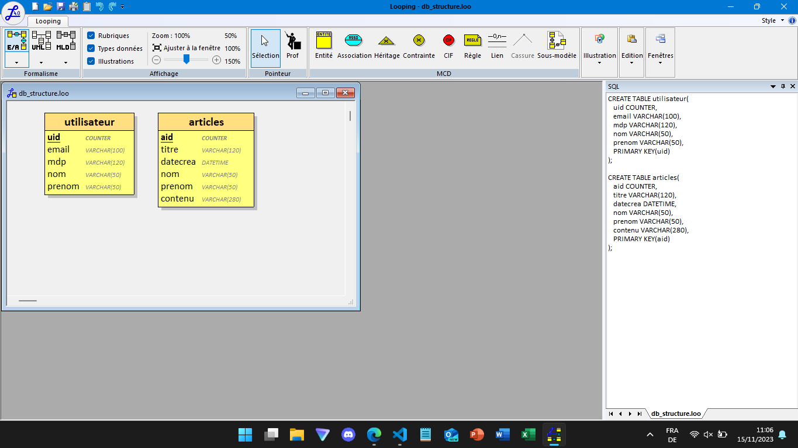

# TIMELINE
## Partie Réflexion
J'ai commencé par créer un repo git pour stocker mon projet puis j'ai créé dans ce repo deux dossiers :
- back, qui va gérer l'ensemble du côté serveur avec l'installation de cors, express et bcryptjs
- front, qui va gérer l'app avec React

Dans un premier temps, je vais commencer par réfléchir à la structure de ma base de données et aux différentes tables et lignes qu'elle devra contenir. Une fois la réflexion de la DB effectuée, je vais commencer à réfléchir à comment créer mon API pour gérer toute mon app.  
  
## BACK
### Base de données  
Avant toute chose, je vais réflechir à la structure de ma DB. Pour cela, j'utilise une feuille pour y mettre l'ensemble des tables et des données qui me seront nécessaires puis j'utilise le logiciel looping afin de pouvoir générer un script SQL à partir d'un modèle MCD. Voici la première version de la DB (vous pouvez retrouver le fichier **db_structure.loo** dans /back).
  